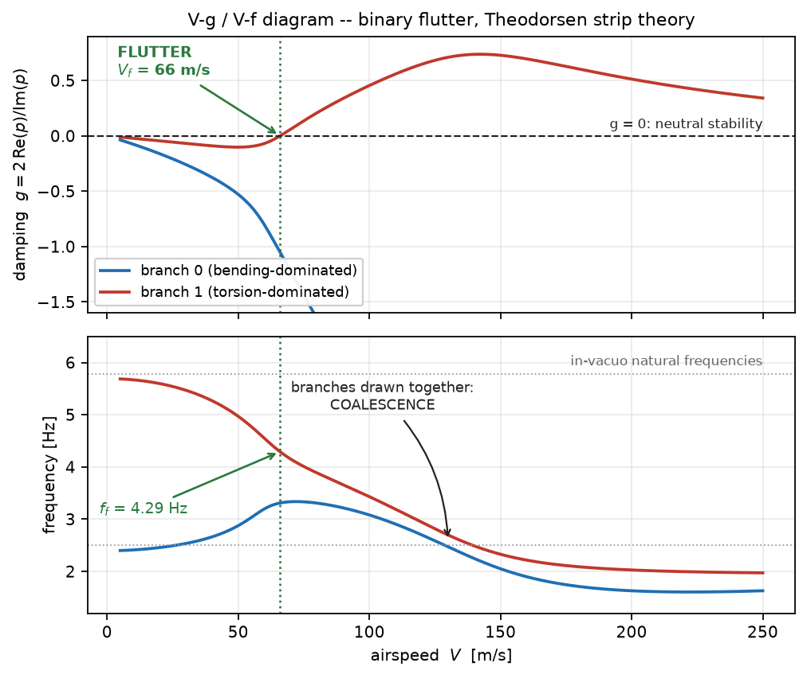

# Flutter Calculator

Predict the **flutter speed of a cantilever wing** from a handful of physically
meaningful numbers — span, chord, sweep, mass, and the first bending and torsion
frequencies. No FEA, no CFD, no licence server. A run takes seconds.

It pairs a Rayleigh–Ritz beam structure with unsteady aerodynamics (analytic strip theory
or a doublet-lattice panel method) and solves for flutter with the p-k method, producing
the V-g / V-f diagram every aeroelasticity course draws by hand:



Built for teaching, coursework, and preliminary design — the regime where you want to
know *which way* a design change moves the flutter speed, and you want the answer before
lunch. It is **not** a certification tool; see [Limitations](#limitations).

## Install

```bash
git clone https://github.com/yihattori/flutter_calculator.git
```

```bash
cd flutter_calculator && python -m pip install -e ".[dev]"
```

That gives you the analytic `theodorsen` backend and the full test suite. The
doublet-lattice backend additionally needs [PanelAero](https://github.com/DLR-AE/PanelAero):

```bash
python -m pip install "git+https://github.com/DLR-AE/PanelAero.git"
```

Python 3.10+, NumPy, SciPy and matplotlib. Nothing else.

## Quick start

Open **`flutter_sweep.py`**, edit the `CONFIG` block at the top, and run it. There is no
other setup — the script puts `src/` on the path itself.

```bash
python flutter_sweep.py
```

Pick a preset aircraft or describe your own wing:

```python
PRESET = "A320"           # A320 A330 A350 ATR72 B737 B767 B777 B787 CRJ900 E190
                          # ... or "custom" and fill in CUSTOM_WING below
CUSTOM_WING = dict(
    semi_span      = 16.0,    # exposed half-span, root to tip             [m]
    root_chord     = 5.5,     # chord at the root                          [m]
    tip_chord      = 1.6,     # chord at the tip                           [m]
    sweep_deg      = 25.0,    # quarter-chord sweep, positive aft          [deg]
    ea_frac        = 0.40,    # elastic axis, fraction of chord aft of LE  [-]
    cg_frac        = 0.46,    # section CG,  fraction of chord aft of LE   [-]
    half_wing_mass = 6000.0,  # structural + fuel mass of the half-wing    [kg]
    f_bending      = 2.0,     # target 1st bending frequency               [Hz]
    f_torsion      = 5.5,     # target 1st torsion frequency               [Hz]
)
```

You get a console summary and a V-g / V-f diagram:

```
 RESULT: FLUTTER at V = 211.1 m/s,  f = 3.46 Hz,  index = 0.535  (branch 1)
```

**V** is the true airspeed where the tracked branch's damping crosses zero. **f** is the
flutter frequency — for classical bending–torsion flutter it lands between the bending and
torsion natural frequencies as the two branches coalesce. **index** is the dimensionless
flutter-speed index *V*<sub>f</sub> / (*b* ω<sub>α</sub> √µ), which lets you compare wings
of different size and density; transport wings typically land around 0.4–0.6.

Notice you never supply *EI* and *GJ*. You rarely know them early on, but you can usually
name the wing's first bending and torsion frequencies — so the builder calibrates the
stiffnesses until the as-built wing, engine attached, hits the frequencies you asked for.

## Using it as a library

```python
from flutter_calc.wing import build_wing
from flutter_calc.solvers.pk import pk_flutter
import numpy as np

wb = build_wing(semi_span=16.0, root_chord=5.5, tip_chord=1.6, sweep_deg=25.0,
                half_wing_mass=6000.0, f_bending=2.0, f_torsion=5.5,
                ea_frac=0.40, cg_frac=0.46, backend="theodorsen")

result = pk_flutter(wb.structure, wb.aero, np.linspace(40, 400, 200),
                    rho=1.225, b_ref=wb.b_ref)
print(result.lowest_flutter())
```

## What's in the box

| Module | What it does |
|---|---|
| `conventions.py` | Reference length, `k = ωb/U`, sign and damping conventions — one source of truth |
| `geometry.py` | `WingGeometry`, `PointMass`; spanwise property distributions |
| `structures/` | Assumed shapes and Rayleigh–Ritz assembly of the generalized **M** and **K** |
| `aero/theodorsen.py` | Analytic 2-D unsteady strip theory (incompressible, unswept) |
| `aero/dlm.py` | Doublet-lattice panel aerodynamics (swept, subsonic-compressible) |
| `aero/cache.py` | Tabulates `Qhh(k)` on a grid — the DLM is far too slow to call inside the p-k loop |
| `solvers/pk.py` | The p-k flutter solver, MAC branch tracking, and `divergence_speed` |
| `envelope.py` | ISA atmosphere, matched-point flutter boundary, CS-25.629 margins |
| `nondim.py` | Mass ratio, static unbalance, radius of gyration, flutter-speed index |
| `postprocess/` | V-g / V-f, flutter boundary and index-vs-Mach plots |
| `cases/` | Ready-made wings: textbook binary flutter, AGARD 445.6, a transport half-wing |

Both aero backends satisfy one contract — `Qhh(k, Ma) -> complex[n, n]` — so the solver
neither knows nor cares which is plugged in, and adding a third is a single class.

## Documentation

A **usage guide** covering every parameter, how to read the output, troubleshooting and
the library API is built from source rather than committed as a binary:

```bash
python -m pip install -e ".[docs]"
python docs/figures.py            # regenerate the figures (--fast skips the DLM one)
python docs/make_usage_guide_pdf.py
```

That writes `flutter_calculator_usage_guide.pdf` to the repository root. The guide runs
`flutter_sweep.py` while building, so the transcript it prints is a real one.

## Validation

`python -m pytest` runs 32 tests, each checking the physics against something independent
rather than against a stored answer:

| Test | Checked against |
|---|---|
| Theodorsen `C(k)` | An independent Bessel-function form, plus the `C(0)=1`, `C(∞)=1/2` limits |
| Rayleigh–Ritz free vibration | The exact closed-form frequencies of a uniform clamped–free beam |
| Binary flutter | The textbook qualitative signatures: frequency coalescence, flutter frequency between the natural frequencies, stability well below `V_f` |
| Doublet lattice | Must reduce to 2-D strip theory in the high-aspect-ratio incompressible limit |
| AGARD 445.6 | The published subsonic flutter-speed index of the standard swept-wing benchmark |
| ISA atmosphere | Standard atmosphere tables |
| Matched point | Self-consistency `M = V_f / a` against an analytic oracle |
| Solver guards | Divergence is detected and labelled; spurious high-frequency crossings are filtered |

## Limitations

Worth reading before you trust a number.

- **Linear and subsonic.** The doublet-lattice method cannot represent the transonic
  flutter dip. Above Mach 0.85 results are flagged as outside validity rather than
  reported as predictions; above 0.95 the code refuses outright.
- **Beam, not a plate or an FE model.** A single cantilever wing with assumed shapes. No
  fuselage, no free-free modes, no control surfaces, no stores.
- **Sweep enters through the aerodynamics only.** The elastic bend–twist coupling a real
  swept box beam has is not modelled.
- **Flat-plate aerodynamics.** No thickness, camber, viscosity, or separation.
- **Linear flutter onset only.** No gust response, no limit-cycle oscillation, no
  post-flutter behaviour.
- **The aircraft presets are representative estimates**, assembled from public span and
  weight figures with plausible structural anchors. They are not certified data. Absolute
  margins are only as good as the frequencies you feed in — flutter speed scales roughly
  linearly with the torsion frequency.

Use it for relative studies, trends and teaching. Certification needs a validated FE
model, measured GVT data, and the transonic regime done properly.

## Contributing

Issues and pull requests are welcome. If you change the physics, add a test that pins the
behaviour against something independent — that is the convention throughout the suite.

## Credits

The doublet-lattice aerodynamics come from **[PanelAero](https://github.com/DLR-AE/PanelAero)**
by the **DLR Institute of Aeroelasticity** (Deutsches Zentrum für Luft- und Raumfahrt e.V.),
under the BSD 3-Clause licence. None of the unsteady-kernel mathematics is implemented
here — this project builds the panel mesh and the modal downwash, and projects the
pressures PanelAero returns onto the Ritz modes. PanelAero is installed from its own
upstream source and no part of it is copied into this repository.

**If you publish results computed with the `dlm` backend, please cite PanelAero** as well
as this project; its repository states the current recommended reference. The DLR is named
here only to identify the authors of software this project depends on — it neither
endorses nor is affiliated with Flutter Calculator.

Full attribution, the BSD 3-Clause text, and the published methods behind the rest of the
model (Theodorsen 1935; Albano & Rodden 1969; AGARD 445.6; the 1976 ISA) are in
[THIRD_PARTY_NOTICES.md](THIRD_PARTY_NOTICES.md) and [LICENSE](LICENSE).

## Licence

MIT — see [LICENSE](LICENSE), which also carries the third-party notices.
